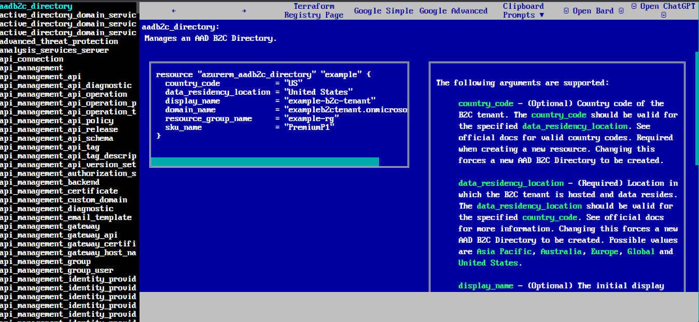

We have here a more user-friendly guide of the Terraform Registry.

I actually did this project before in 2018.

It fell out of favor with me. I just didn't like it and felt in 2023 it needed a revamp. And you see what you currently see now. It's so so improved. Instead of just examples in one page, there's navigation, one click functionality & the Terraform arguments in a IBM/Microsoft DOS like interface.

The inspiration came from working with VPC Lattice Terraform practically hands-on. I wanted one place where I can look at the example configuration of Terraform and easily look at the possible arguments on another panel rather than scrolling up and down to compare the example to the possible arguments/variables. It also allowed me to see all the possible services that I might have missed. This website gives me & employees options as to understand the cloud in one place at a high level before exploring further. I feel this expedites becoming a cloud master at a faster rate.

There are options to use this for one-click google searches or prompts for AI. I could have used the paid AI API to gain greater insights. I can see that happening.

[Microsoft Azure Terraform Reference](https://mmulcahy222.github.io/terraform_reference_guides/terraform_guide.html?cloud=azurerm)
[Amazon AWS Terraform Reference](https://mmulcahy222.github.io/terraform_reference_guides/terraform_guide.html?cloud=aws)
[Google Cloud Terraform Reference](https://mmulcahy222.github.io/terraform_reference_guides/terraform_guide.html?cloud=google)
[IBM Cloud Terraform Reference](https://mmulcahy222.github.io/terraform_reference_guides/terraform_guide.html?cloud=google)

