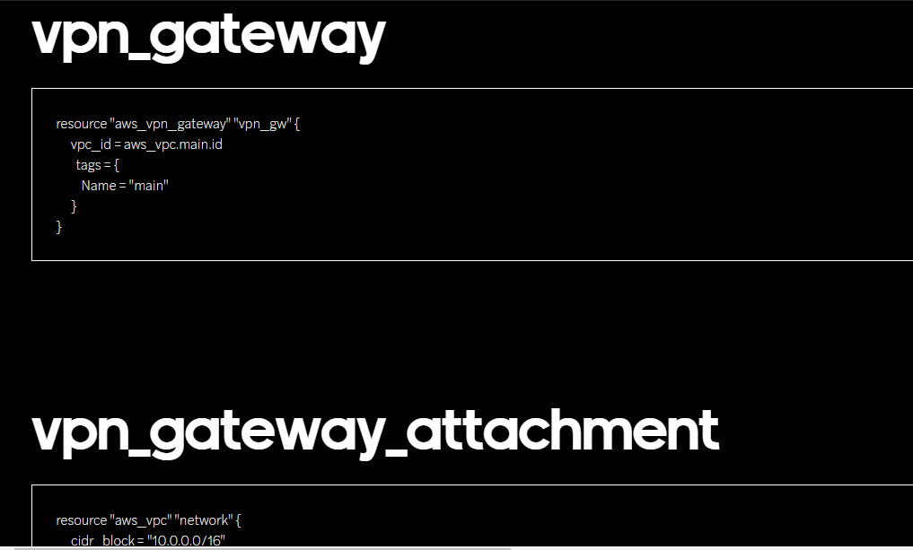

# Terraform Commands for Microsoft, Amazon & Google Cloud

I made myself three Terraform user guides for three clouds of Microsoft Azure & Amazon AWS & Google Cloud. 

The Terraform command syntax for every service has been collated all in one page for one easy-to-use reference guide. 

[Amazon AWS Terraform Guide](https://mmulcahy222.github.io/amazon_aws.html)
[Microsoft Azure Terraform Guide](https://mmulcahy222.github.io/microsoft_azure.html)
[Google Cloud Terraform Guide](https://mmulcahy222.github.io/google_cloud.html)



This also existed in one other place by another user, but I decided to make my own for these reasons:

1) I like the way mine looked better, and I used the Adidas font as the section title.
2) By programming it myself, I had flexibility as to how the guide looked, and I could add or omit what I chose, and there was a lot of fat to trim in other solutions
3) I wanted to get better in Microsoft Visual Studio Code

The reason for this reference guide is to give myself a bird's eye view of all the services in each cloud. 

Since each cloud has hundreds of services, they use other parts of the cloud for these services. It could be very hard to keep track of the inter-connections among each parts of the cloud to understand the cloud in general. 

A high-level bird's eye view of the cloud should allow somebody to see all of the services in action to quickly understand what other services it uses. It's like a textual form of mind-mapping or "Gremlin" graph.

The section title with the Adidas font will link to the official Terraform page in case more information is needed. These pages in the links can be very useful for a real-life setting.

Strategic use of Design Patterns & Object Oriented Programming was used to seperate out the differnet clouds in this project, reducing the need for convoluted "If Statements" and adhering to the "O" part of SOLID principles (Open-Closed principles)

```python
class Cloud:
    @property
    def local_directory(self):
        return f'redacted'
    @property
    def local_json_directory(self):
        return self.local_directory + "json/"
class AmazonAWS(Cloud):
    provider_id = '8847'
    cloud_name = 'amazon_aws'
    terraform_url_part = 'aws'
class MicrosoftAzure(Cloud):
    provider_id = '8835'
    cloud_name = 'microsoft_azure'
    terraform_url_part = 'azurerm'
class GoogleCloud(Cloud):
    provider_id = '8708'
    cloud_name = 'google_cloud'
    terraform_url_part = 'google'
class ProviderResources():
    '''
    This represents the page/json file that has all of the resource IDS & other resource information/nodes
    '''
    def __init__(self,cloud_object):
        self.cloud_object = cloud_object
    def get_resources_json(self):
        provider_id = self.cloud_object.provider_id
        cloud_name = self.cloud_object.cloud_name
```